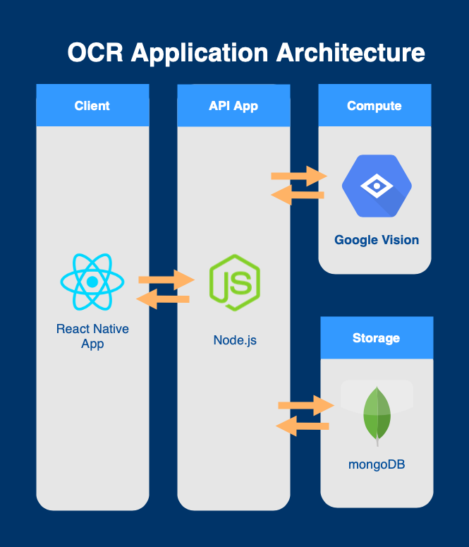

# OCR Client React Native App

It is a OCR client application, have to work with the [server](https://github.com/ericc0504/ocr-processor).

## System Architecture

## Functions

- Capture image from camera
- Upload image and get OCR result from server
- Show all history results

## Requirements

- `node`: 12.18.2
- `expo-cli`: 3.24.2

## Build

- Run `npm install`
- Run `npm start`

## Run on your device

- Download Expo Client from [App Store](https://apps.apple.com/us/app/expo-client/id982107779) or [Play Store](https://play.google.com/store/apps/details?id=host.exp.exponent)
- Use Expo Client to view the app
